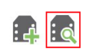
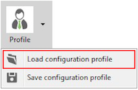
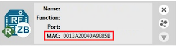
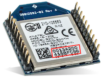
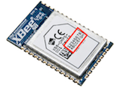

XbeeMav
=========================

Description:
============

XbeeMav allows to configure, test and communicate with Xbee devices through ROS, and specifically through [mavros](http://wiki.ros.org/mavros).

Requirements
============

* ROS **base** binary distribution (Indigo or Kinetic):

The steps for installing ROS Kinetic on Ubuntu are detailed [here](https://wiki.ros.org/kinetic/Installation/Ubuntu).

* ROS additionnal dependencies:

You will need the [mavros](http://wiki.ros.org/mavros) packages.
```
sudo apt-get install ros-<distro>-mavros ros-<distro>-mavros-extras
```

* XCTU 

You will need the XCTU application for the initial configuration of new XBees.
It can be downloaded [here](https://www.digi.com/products/iot-platform/xctu#productsupport-utilities).

* XBee modules

We have tested this with the [Digi XBee-PRO 900HP](https://www.digi.com/products/embedded-systems/rf-modules/sub-1-ghz-modules/xbee-pro-900hp), the [Digi XBee SX (900MHz)](https://www.digi.com/products/embedded-systems/rf-modules/sub-1-ghz-modules/xbee-sx) and the [Digi XBee SX 868](https://www.digi.com/products/embedded-systems/rf-modules/sub-1-ghz-modules/digi-xbee-sx-868).


Configure the XBees. 
===========

You first need to put the right configuration on the XBees using XCTU. 
We provide some profile files for both XBee modules we have used in `Resources/xctu_profiles`:
- [xbee_pro_900_hp.xpro](Resources/xctu_profiles/xbee_pro_900_hp.xpro) for the Digi XBee-PRO 900HP.
- [xbee_sx.xpro](Resources/xctu_profiles/xbee_sx.xpro) for the Digi XBee SX and Digi XBee SX 868.

In order to load the profiles, open XCTU and connect the XBee module to your computer.

You will first need to add the XBee module. You can do so by clicking on the **Discover radio modules** button: 



Select the port where you have connected the XBee, the parameters to search for, and scan.
The XBee module should be found, and you can then start configuring it.

From the configuration operating mode:


You can load the appropriate configuration profile from `Resources/xctu_profiles` by selecting the **Load configuration profile** option:



XCTU might ask to update the firmware to load the profile.


Update the database.
===========
In order for your XBee module to be recognized, it is necessary to add it to the database file.

To do so, you need to find the MAC address of your XBee module.

If you added the module to XCTU, you can read it directly from XCTU:



The MAC address is also written directly on the module:

 

Now, you have to add the MAC address to the [Resources/database.xml](Resources/database.xml) file.

Add a line within the `<Addresses>` and `</Addresses>` tags with the following format, replacing N by an integer ID not yet used in the database file, and MAC_ADDRESS by the MAC address of your XBee module:
```
		<Device Address= "N"  >MAC_ADDRESS</Device>
```
Compilation
===========

```
mkdir -p ~/ROS_WS/src
cd ~/ROS_WS/src
git clone https://github.com/MISTLab/XbeeMav xbeemav
cd ..
catkin_make
```

Source ROS environment
===========

```
source /opt/ros/kinetic/setup.bash
source ~/ROS_WS/devel/setup.bash
```


Run
===
To run the XbeeMav package using the launch file, execute the following:
```
roslaunch xbee_ros_node xbeemav.launch
```

Publishers
-----------

* /inMavlink [mavros_msgs/Mavlink]

Subscribers
-----------

* /outMavlink [mavros_msgs/Mavlink]

Services
-------

* /network_status [mavros_msgs/ParamGet]

This service can take 3 values:
1. `id` for the network id for the XBee module registered in the [database.xml](Resources/database.xml) file.
2. `rssi` for the signal strength of last message received.
3. `pl_raw_avg` for the average packet loss.